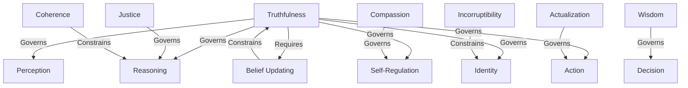
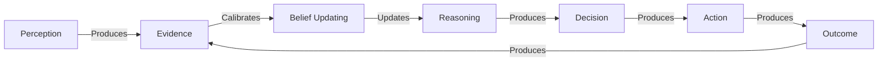
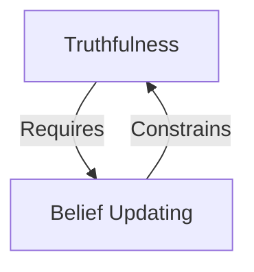
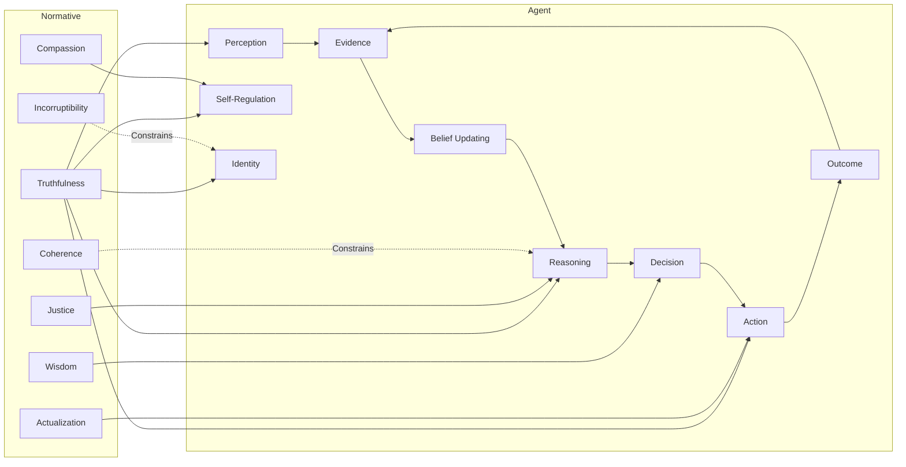

# Specification Framework

> A formal specification consisting of two interacting directed graphs:
>
> - **Normative Graph** — defines governing, requiring, and constraining relationships.
> - **Causal Graph** — defines information flow and causal dynamics.

---

# I. Normative Graph

## Primitive Edge Types

| Edge | Meaning |
|------|---------|
| Requires | A normative dependency. |
| Governs | A normative authority or guiding principle. |
| Constrains | A normative limitation or admissibility condition. |

## Axioms

| ID | Proposition |
|----|-------------|
| N1 | Truthfulness → Requires → Belief Updating |
| N2 | Belief Updating → Constrains → Truthfulness |
| N3 | Truthfulness → Governs → Perception |
| N4 | Truthfulness → Governs → Reasoning |
| N5 | Truthfulness → Governs → Self-Regulation |
| N6 | Truthfulness → Governs → Identity |
| N7 | Truthfulness → Governs → Action |
| N8 | Justice → Governs → Reasoning |
| N9 | Compassion → Governs → Self-Regulation |
| N10 | Wisdom → Governs → Decision |
| N11 | Coherence → Constrains → Reasoning |
| N12 | Actualization → Governs → Action |
| N13 | Incorruptibility → Constrains → Identity |

---

## Normative Graph



---

# II. Causal Graph

## Primitive Edge Types

| Edge | Meaning |
|------|---------|
| Produces | Generates or causes. |
| Calibrates | Adjusts according to evidence. |
| Updates | Revises internal state. |

## Axioms

| ID | Proposition |
|----|-------------|
| C1 | Perception → Produces → Evidence |
| C2 | Evidence → Calibrates → Belief Updating |
| C3 | Belief Updating → Updates → Reasoning |
| C4 | Reasoning → Produces → Decision |
| C5 | Decision → Produces → Action |
| C6 | Action → Produces → Outcome |
| C7 | Outcome → Produces → Evidence |

---

## Causal Graph



---

# III. Chain of Logic

## Normative Invariant



---

## Causal Invariant


---

# IV. Boolean Vocabulary

## Symbols

| Symbol | Definition |
|--------|------------|
| T | Truthfulness |
| J | Justice |
| C | Compassion |
| W | Wisdom |
| H | Coherence |
| Ac | Actualization |
| Ic | Incorruptibility |
| BU | Belief Updating |
| P | Perception |
| R | Reasoning |
| SR | Self-Regulation |
| Id | Identity |
| D | Decision |
| A | Action |
| O | Outcome |
| E | Evidence |

---

## Normative Predicates

| Predicate | Definition |
|-----------|------------|
| Req(x,y) | x requires y |
| Gov(x,y) | x governs y |
| Con(x,y) | x constrains y |

---

## Causal Predicates

| Predicate | Definition |
|-----------|------------|
| Prod(x,y) | x produces y |
| Cal(x,y) | x calibrates y |
| Upd(x,y) | x updates y |

---

# V. Normative Propositions

```text
Req(T, BU)
Con(BU, T)

Gov(T, P)
Gov(T, R)
Gov(T, SR)
Gov(T, Id)
Gov(T, A)

Gov(J, R)
Gov(C, SR)
Gov(W, D)
Gov(Ac, A)

Con(H, R)
Con(Ic, Id)
```

---

# VI. Causal Propositions

```text
Prod(P, E)
Cal(E, BU)
Upd(BU, R)
Prod(R, D)
Prod(D, A)
Prod(A, O)
Prod(O, E)
```

---

# VII. Fixed Normative Invariant

```text
Req(T, BU)
∧
Con(BU, T)
```

---

# VIII. Fixed Causal Invariant

```text
Prod(P, E)
→ Cal(E, BU)
→ Upd(BU, R)
→ Prod(R, D)
→ Prod(D, A)
→ Prod(A, O)
→ Prod(O, E)
```

---

# IX. Conceptual Architecture



---

## Summary

The specification defines two orthogonal but interacting systems:

- **Normative Graph**
  - Specifies what *ought* to govern, require, or constrain the agent.

- **Causal Graph**
  - Specifies how information and decisions propagate through the agent over time.

The shared ontology (Perception, Belief Updating, Reasoning, Decision, Action, etc.) links these layers into a unified specification that separates **normative semantics** from **causal dynamics**.
