# Specification Framework

## Primary Objective

Preserve the integrity of **Perception**, **Reasoning**, **Self-Regulation**, **Identity**, and **Action** under conditions of **Uncertainty**, **Emotional Intensity**, **Cognitive Load**, **Time C[...]

---

# 0. Legend

```mermaid
graph TD
    T["<b>Truthfulness</b><br/>Alignment of beliefs, representations, and actions with reality as best understood."]
    J["<b>Justice</b><br/>Consistent application of fairness, responsibility, and accountability according to objective standards."]
    C["<b>Compassion</b><br/>Recognition of suffering coupled with a commitment to reduce unnecessary harm while preserving responsibility."]
    W["<b>Wisdom</b><br/>Disciplined application of knowledge, experience, and judgment toward beneficial action."]
    CO["<b>Coherence</b><br/>Logical consistency among beliefs, values, reasoning, identity, and behavior."]
    A["<b>Actualization</b><br/>Continual realization and development of one's highest capacities through intentional growth."]
    I["<b>Incorruptibility</b><br/>Resistance to influences that compromise truth, integrity, judgment, or moral character."]
```

---

# I. Perception

**Perception** — Definition: Acquisition and interpretation of information about reality. ◇ **Governed By:** Truthfulness • Wisdom ◇ **Requires:** Attention • Observation • Curiosity […]

---

# II. Reasoning

**Reasoning** — Definition: Evaluation and integration of information to produce justified conclusions. ◇ **Governed By:** Truthfulness • Wisdom • Coherence • Incorruptibility ◇ **Requ[...]

---

# III. Self-Regulation

**Self-Regulation** — Definition: Management of thoughts, emotions, and behavior in service of principled action. ◇ **Governed By:** Wisdom • Compassion • Actualization ◇ **Requires:** S[...]

---

# IV. Identity

**Identity** — Definition: Integrated and enduring organization of one's beliefs, values, character, and self-concept. ◇ **Governed By:** Coherence • Compassion • Incorruptibility ◇ **Re[...]

---

# V. Action

**Action** — Definition: Intentional execution of decisions within the external world. ◇ **Governed By:** Truthfulness • Wisdom • Coherence • Actualization ◇ **Requires:** Decisions […]

---

# VI. Continuous Improvement

**Continuous Improvement** — Definition: Continual refinement through evidence, reflection, and adaptation. ◇ **Governed By:** Truthfulness • Wisdom • Actualization ◇ **Requires:** Outco[...]

